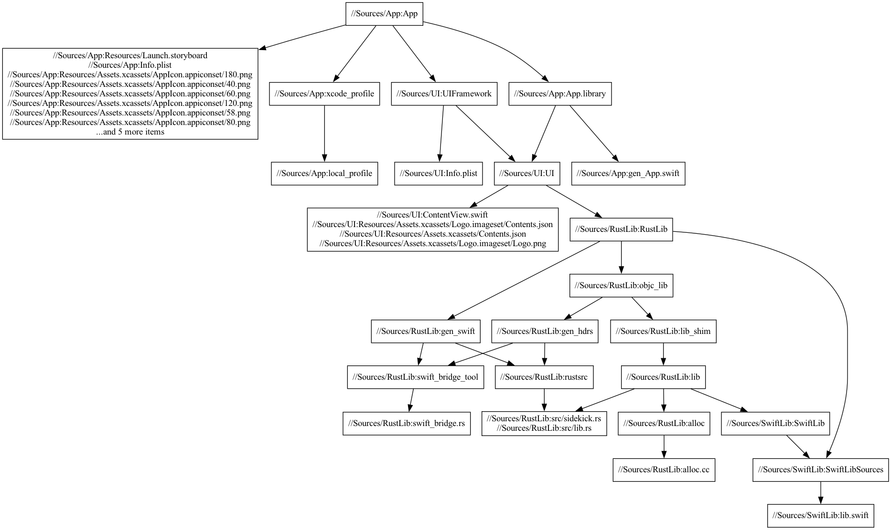

# BazelCon 2022 Demo, Now With [`swift-bridge`](https://github.com/chinedufn/swift-bridge)

`swift-bridge` integration could certainly be improved, but it's a start. See
`Sources/RustLib/BUILD` for the details. Supports Swift calling Rust with opaque
types passed between them. Rust can also call swift, but only with primitives
right now. Visualization of the project build graph:



```
$ bazel query 'deps(//Sources/App)' --output graph > graph_full.in
$ cat graph_full.in | grep -v "@" | grep -v "label" > graph_pruned.in
$ dot -Tpng < graph_pruned.in > graph_pruned.png
```

<a href="https://youtu.be/B__SHnz3K3c" title="YouTube - How to integrate Bazel with Xcode using rules_xcodeproj"></a>

## Commands

### Whole project

```
bazel run //:xcodeproj
xed Demo.xcodeproj
```

### Focused project

```
bazel run //:xcodeproj-focused
xed Demo-Focused.xcodeproj
```
